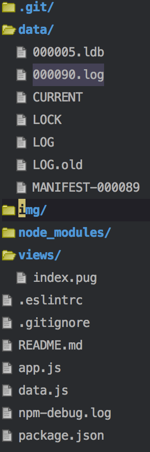

This is a simple data parser app for working with [http://scott.dada.pink/](http://scott.dada.pink/) put together at the Lens Hack/Hackers Hackathon

# The problem

Although scott.dada is fine for entering data, viewing summaries, and viewing info on one record at a time, it falls down when trying to view a bunch of records at once. It allows the option to export to csv, but the exports are huge, have many line breaks in cells, and generally cannot be opened by spreadsheet programs.

# The solution

This is a very simple app to take a database dump, and put a front-end on it that will allow the data to be projected and filtered in several useful ways to actually get it to open in a spreadsheet.

Note that to use this you will have to take a [leveldb data dump from `http://scott.data.pink`](http://scott.dada.pink/level-db.tar.gz). The webapp then parses and serves data from this dump (see below for setup instructions).

This application is written as a nodejs webapp, while this is not necessary, it was the most techincally expedient manner of achieving our goals. Some better solutions:

1. Put this into a bundled [Electron app](http://electron.atom.io/). (Electron uses its own version of node that is not compatible with the leveldown package used here. This can be resolved but will take a bit of time)
2. Even better, rewrite this in django and insert this into the original application. (How does deployment work?)

# Installation

To run this you will first of all need [nodejs installed](https://nodejs.org/en/). This application was tested with node v7.2.0 but will likely work with anything higher.

[Download or clone this source code from Github](https://github.com/togakangaroo/scott2-leveldb-parser)

Navigate to the directory for the source code in a terminal (Win+R then type "powershell" on Windows). Type `npm install` which should download and install a bunch of dependencies.

Download the [leveldb data dump from `http://scott.data.pink`](http://scott.dada.pink/level-db.tar.gz). Use a zip program to unzip it. Put all contents into a directory named `data` inside of this directory. It should look like this:

Type `npm start` to start the webserver. It should tell you that a webserver is started on `http://localhost:8121`

Navigate to `http://localhost:8121` in your web browser
